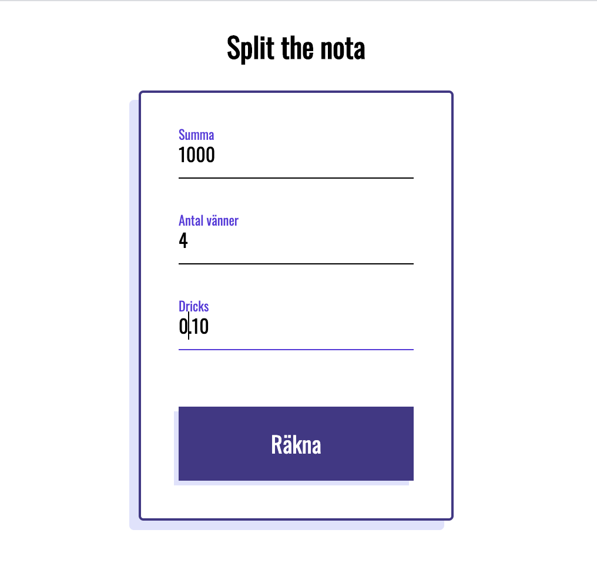
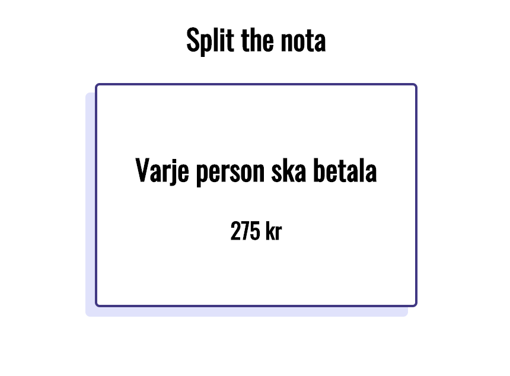

# Övning: Moduler - split the nota

## Instruktioner

**Syftet med övningen är att testa att dela upp koden i moduler och importera dessa i din main.js (eller vad din js-fil nu heter)**

Split the nota räknar ut hur mycket varje vän ska betala på exempelvis en restaurang när notan kommer. Användaren matar in summan, antal vänner och sedan dricks (**som skrivs i decimalform d.v.s 10% blir 0.10**).

All HTML, CSS och Javascript som ni behöver finns. Er utmaning är att lägga all kod i index.js i rätt ordning så sidan funkar. Testa er fram och använd konsolen i Chrome developer tools för att se eventuella Javascript fel. När sidan funkar har ni löst det. **Ni behöver inte skriva någon ny JS-kod utan all kod som behövs finns.**

### Screenshots

**Räkna ut**

**Visa summa**
